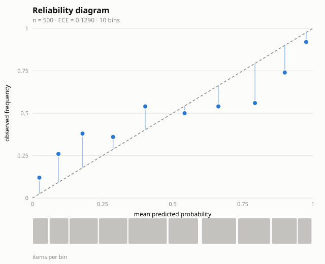

# calikit

Calibration auditing for probabilistic predictions.

[](https://github.com/mohammadi-hadi/calikit/actions/workflows/test.yml)
[](https://pypi.org/project/calikit/)
[](https://doi.org/10.5281/zenodo.21808288)
[](LICENSE)

A model that says "90%" should be right 9 times out of 10. Most aren't:
modern classifiers — and LLM judges scoring on a 1–10 scale — are routinely
over-confident, and accuracy alone never shows it. calikit reads a JSONL file
of predictions and outcomes and answers three questions: how miscalibrated is
the model, is that miscalibration statistically significant or just sampling
noise, and what mapping fixes it. Standard library only, no dependencies.

**Interactive explorer:** https://mohammadi.cv/calikit/

## Install

```
pip install calikit
```

Or from source: `git clone https://github.com/mohammadi-hadi/calikit && cd calikit && make install`.

## Is my model over-confident?

```
$ calikit audit examples/preds.jsonl
n = 500   base rate: 49.2%
Brier: 0.2199  [0.1960, 0.2432]   (always-predict-base-rate: 0.2499)
log loss: 0.6514   AUC: 0.745
ECE (10 mass bins): 0.1290  [0.0940, 0.1690]   MCE: 0.2336
over-confident in 5/10 bins (confidence above observed frequency)
decomposition: reliability 0.0202   resolution 0.0476   uncertainty 0.2499
Spiegelhalter's Z: 9.22   p: 0.0000
verdict: miscalibration is significant at the 95% level
```

Reading the report:

- **Brier** and **log loss** are proper scoring rules — the headline numbers.
  The bracketed interval is a bootstrap CI; the base-rate Brier is what a
  model with no skill at all would score.
- **ECE** is the intuitive one: on average, stated confidence is 12.9 points
  away from observed frequency. It comes with a CI because ECE on a few
  hundred items is noisy.
- **Spiegelhalter's Z** tests whether the miscalibration could be sampling
  luck. Here Z = 9.2: it could not.
- The **decomposition** (Murphy) splits the Brier score into reliability
  (the part recalibration can remove), resolution (real discrimination), and
  uncertainty (the base rate's floor).

Add `--svg reliability.svg` to get a publication-ready reliability diagram —
this one is generated from the example data:



## Fix it

```
$ calikit fit examples/preds.jsonl --method temperature --out mapping.json
temperature scaling on 500 items: T = 2.062  (predictions were over-confident)
scores on the fitting data:
              before     after
Brier           0.2199    0.2032
log loss        0.6514    0.5881
ECE             0.1290    0.0425
(in-sample numbers flatter the fit; pass --eval FILE for an honest read)
wrote mapping to mapping.json
```

T = 2.06 means the model's logits were about twice as sharp as the evidence
allowed. Three mappings are available: `temperature` (one parameter, hard to
overfit — the default), `platt` (adds a bias term), and `isotonic`
(non-parametric, needs more data). Fit on one split and score on another with
`--eval`.

## Ship the fix

```
$ calikit apply mapping.json examples/preds.jsonl --out calibrated.jsonl
calibrated 500 records -> calibrated.jsonl (method: temperature)
$ calikit audit calibrated.jsonl
...
Spiegelhalter's Z: 0.17   p: 0.8674
verdict: no significant miscalibration at the 95% level
```

The mapping is a small JSON file you can version-control and apply anywhere;
`apply` keeps the original value in `p_raw`.

## LLM judges too

Judge scores on a 1–10 scale are just uncalibrated probabilities. Point
`--rescale` at the scale and audit them against human labels:

```
$ calikit audit examples/judge_scores.jsonl --prob-key score --label-key human --rescale 1,10
n = 300   base rate: 44.3%
Brier: 0.1936  [0.1646, 0.2227]   (always-predict-base-rate: 0.2468)
log loss: 1.6377   AUC: 0.795
ECE (10 mass bins): 0.1196  [0.0819, 0.1663]   MCE: 0.2667
...
verdict: miscalibration is significant at the 95% level
```

Note the log loss: 1.64 against a 0.25-Brier baseline. A judge that says
10/10 and is wrong pays the maximum penalty — that is what over-confidence
costs when you use judge scores as probabilities downstream.

## Data format

JSONL, one prediction per line, any extra fields ignored:

```json
{"id": "item-001", "p": 0.83, "y": 1}
{"id": "item-002", "p": 0.35, "y": 0, "category": "reasoning"}
```

`--prob-key` and `--label-key` rename the fields; labels may be 0/1 or
true/false. The files in `examples/` are generated by
`examples/make_fixtures.py` (seeded, so they're reproducible), and the
diagram above is `calikit audit` output on them.

## Python API

Everything the CLI does is a plain function:

```python
from calikit import bin_predictions, ece, extract, fit_temperature, read_jsonl, spiegelhalter

probs, labels = extract(read_jsonl("examples/preds.jsonl"))
bins = bin_predictions(probs, labels, k=10)      # equal-mass bins
ece(bins)                                        # 0.1290
z, p = spiegelhalter(probs, labels)              # 9.22, p ~ 0
mapping = fit_temperature(probs, labels)         # T = 2.062
calibrated = mapping.apply(probs)
```

## What's inside

| Question | Method |
|---|---|
| How far off are the probabilities? | ECE / MCE over equal-mass or equal-width bins, with bootstrap CIs |
| Is it real or sampling noise? | Spiegelhalter's Z test |
| How good are the predictions overall? | Brier score with Murphy decomposition, log loss, AUC |
| How do I fix it? | Temperature scaling, Platt scaling, isotonic regression (PAVA) — all hand-rolled, no scipy |
| What does it look like? | Reliability diagram as standalone SVG |

Proper scoring rules (Brier, log loss) are the primary numbers; ECE is
reported because it is interpretable, with a CI because it is noisy.

## Honest limitations

- ECE depends on the binning and is a biased estimator; that's why it ships
  with a CI and why Brier/log loss are the headline metrics.
- Binary outcomes only for now (multiclass via one-vs-rest is on the
  roadmap).
- In-sample fit numbers are optimistic — `fit` says so, and `--eval` exists
  for a reason. Isotonic regression in particular can overfit small samples.
- Calibration is not discrimination: a model can be perfectly calibrated and
  useless. That's what the AUC and resolution lines are for.
- This is not a stats library. For GLMs and beyond, use statsmodels; calikit
  covers the calibration loop with zero dependencies.

## Sponsoring

calikit is MIT-licensed and dependency-free, and it stays that way.
Sponsoring funds the roadmap below and the maintenance time to keep the
statistics trustworthy. Sponsors are credited in release notes and vote on
what lands next: [GitHub Sponsors](https://github.com/sponsors/mohammadi-hadi).

## Roadmap

- Multiclass support: top-label and classwise ECE.
- `compare`: paired bootstrap test on the Brier difference between two
  prediction files on the same items.
- Kernel ("smooth") ECE, which avoids the binning choice entirely.
- Threshold guidance: expected cost curves once probabilities are calibrated.

## Related projects

- [arenakit](https://github.com/mohammadi-hadi/arenakit) — Bradley-Terry
  leaderboards with simultaneous confidence control.
- [abeval](https://github.com/mohammadi-hadi/abeval) — error bars and paired
  significance tests for eval scores; calikit is about whether the
  probabilities behind them mean anything.
- [rankkit](https://github.com/mohammadi-hadi/rankkit) — ranking evaluation
  with error bars and position-bias correction for click logs.
- [judgekit](https://github.com/mohammadi-hadi/judgekit) — audit LLM judge
  pipelines for bias.
- [judgepanel](https://github.com/mohammadi-hadi/judgepanel) — estimate judge
  accuracy without gold labels (Dawid–Skene).
- [judgewatch](https://github.com/mohammadi-hadi/judgewatch) — monthly public
  bias audits of LLM judges.

## Citing

Releases are archived on Zenodo. Cite the concept DOI
[10.5281/zenodo.21808288](https://doi.org/10.5281/zenodo.21808288), which
always resolves to the latest version; structured metadata is in
[CITATION.cff](CITATION.cff).

## License

MIT — see [LICENSE](LICENSE).
